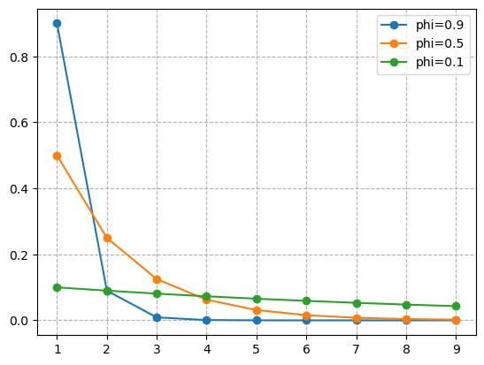
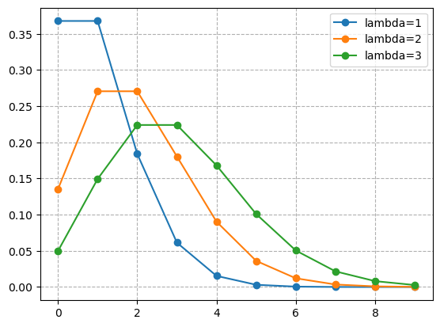

# Distribution Plots（分布图表）


```python
# Third-party imports
import numpy as np
import scipy
import matplotlib.pyplot as plt
```

## Geometric Distribution（几何分布）


```python
# Parameters.
phi1 = 0.9
phi2 = 0.5
phi3 = 0.1

x = np.arange(start=1, stop=10, step=1)

y1 = phi1 * np.power(1 - phi1, x - 1)
y2 = phi2 * np.power(1 - phi2, x - 1)
y3 = phi3 * np.power(1 - phi3, x - 1)

plt.plot(x, y1, 'o', ls='-')
plt.plot(x, y2, 'o', ls='-')
plt.plot(x, y3, 'o', ls='-')
plt.legend(['phi=0.9', 'phi=0.5', 'phi=0.1'])
plt.grid(ls='--')

plt.show()
```


    

    


## Poisson Distribution（泊松分布）


```python
# Parameters.
lambda1 = 1
lambda2 = 2
lambda3 = 3

x = np.arange(start=0, stop=10, step=1)

y1 = np.exp(-lambda1) * np.power(lambda1, x) / scipy.special.factorial(x)
y2 = np.exp(-lambda2) * np.power(lambda2, x) / scipy.special.factorial(x)
y3 = np.exp(-lambda3) * np.power(lambda3, x) / scipy.special.factorial(x)

plt.plot(x, y1, 'o', ls='-')
plt.plot(x, y2, 'o', ls='-')
plt.plot(x, y3, 'o', ls='-')
plt.legend(['lambda=1', 'lambda=2', 'lambda=3'])
plt.grid(ls='--')

plt.show()
```


    

    

